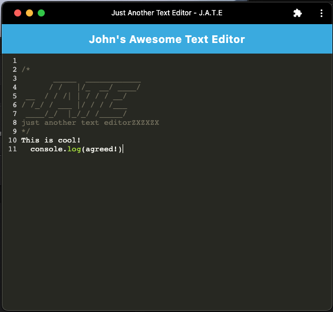

# PWA Text Editor

## Description
This is a project for building a text editor that runs in the browser. The application is designed as a single-page application that fulfills the criteria of a Progressive Web Application (PWA). It incorporates various data persistence techniques to ensure offline functionality. The key aspect of the application is implementing methods to store and retrieve data using an IndexedDB database. To achieve this, the `idb` package is utilized.

## Table of Contents
- [Usage](#usage)
- [Credits](#credits)
- [Features](#features)
- [Access](#access)

## Usage
To run the text editor, use the following steps:

1. Clone the repository.
2. Navigate to the project directory.
3. Install the required dependencies using the command `npm install`.
4. Launch the application by running `npm run start:dev`.
5. Access the text editor in your browser.

The text editor allows you to create and edit text content. It automatically saves the content using IndexedDB, ensuring data persistence even when offline.

## Credits
This text editor project was based on this [starter code](https://github.com/coding-boot-camp/cautious-meme).

## Features
The text editor offers the following features:

- Browser-based text editor.
- Progressive Web Application (PWA) functionality.
- IndexedDB integration for data storage and retrieval.
- Offline functionality.

## Access
You can access the repository and view the deployed app for the text editor project through the following links:

- [Click to View Repository](https://github.com/johnpow/pwa-text-editor)
- [Click for the Deployed Heroku App](https://johnpow-text-editor-6d40d1083695.herokuapp.com/)